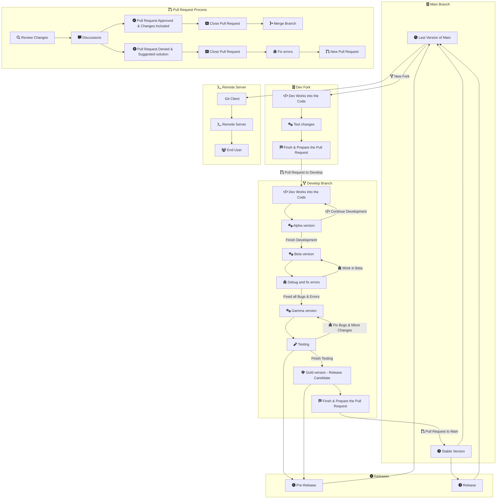
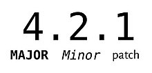

# Contributing


**To start, if you don't have access to edit the main repo you can make a fork of the repo from [here](https://github.com/Isaaker/Ghost_Simulator_ES/fork). We work with pull request, so when you code is ready, you can make a pull request to the Develop branch of the main repo**

## How Repository Works Scheme



### Pull Request Approved

If your Pull Request is approved, the following occurs:

1. It will added to the Develop branch.
2. When the code at Develop branch is ready to release or pre-release, we open a pull request to main and move the code to main.
3. We create a new release or pre-release with the code.
4. We update the remote server with the last main branch code version.

### Pull Request denied

If your Pull Request is denied you will be given a reason why this has occurred and you will be encouraged to further develop your change in a variety of ways either by developing the code further, extending your documentation on the change or any other way. So that the next time you create a pull request it can be approved.

## Documentation

All the project documentation is avaible at a mkdocs page [here](https://isaaker.github.io/archerysimulator/)), this page is hosted in a [different repo](https://github.com/Isaaker/archerysimulator?tab%253Dreadme-ov-file) than the simulator code.

[Learn more about contributing in documentation](./contributing_documentation.md)

## Code Versions and Sources

The Archery Ghost Simulator Project is hosted in GitHub and served by a remote server (not github pages), we use Git and GitHub to manage the different parts of the project and we use different methods as branches and releases to manage and distribute the software. Here, I explain how to use the differents branches and other systems:

### Branches

The project have two esential branches:

**Main:** Stable version of software that does not necessarily contain the same software as an official stable version such as v2.0, from this branch the software is sent to the remote server.

**Develop:** The software that is not yet ready to be moved to the production area is developed in this branch.

### Releases

We use Releases to publish the differents stable and beta versions, this function make possible to get a copy of the current, older or future code versions.

We can difference two types of Releases:

**Releases:** This versions of the code have passed all testing stages and is ready to use in production.

**Pre-Releases:** This version of the code isn't stable, could have some bug and couldn't pass all testing stages.

To display the current software version in the platform we use a integrated variable in __init__.py, this variable needs to be modified before publishing a new release to make them version match.

### Versioning

We use releases to publish new versions, here you can see how we make to name that versions:

Our versioning system differentiates between two parts:

- Numbers: We use three different numbers to name the versions, we change it according to the impact of the changes:



- Release or Pre-Release tag: We use different tags to refer the status of the version:
    - Alpha: Version currently under development.
    - Beta: Finished but undebugged version (may contain bugs and other problems)
    - Gamma: Stable but untested version
    - Gold: Stable and tested version, release candidate
    - Stable: This version corresponds to releases published and currently used in production.

**Example of versioning (included commit IDs are only examples):**

```mermaid
    gitGraph TB:
       branch Develop
       checkout Develop
       commit tag:"v3.0.0-Alpha"
       commit tag:"v3.0.0-Alpha"
       commit tag:"v3.0.0-Beta"
       commit tag:"v3.0.0-Beta"
       commit tag:"v3.0.0-Beta"
       commit tag:"v3.0.0-Gamma"
       commit tag:"v3.0.0-Gamma"
       commit tag:"v3.0.0-Gold"
       checkout main
       merge Develop
       commit tag:"v3.0.0-Stable"
       checkout Develop
```